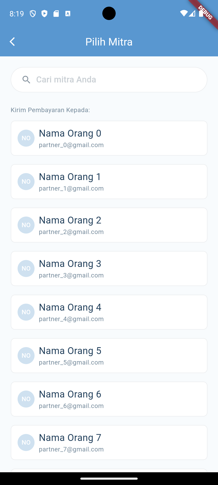
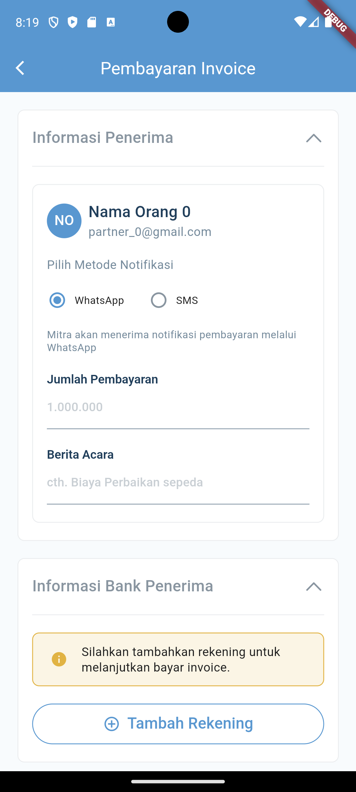
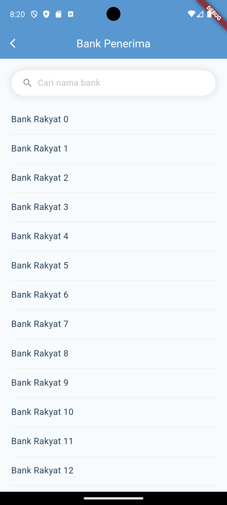
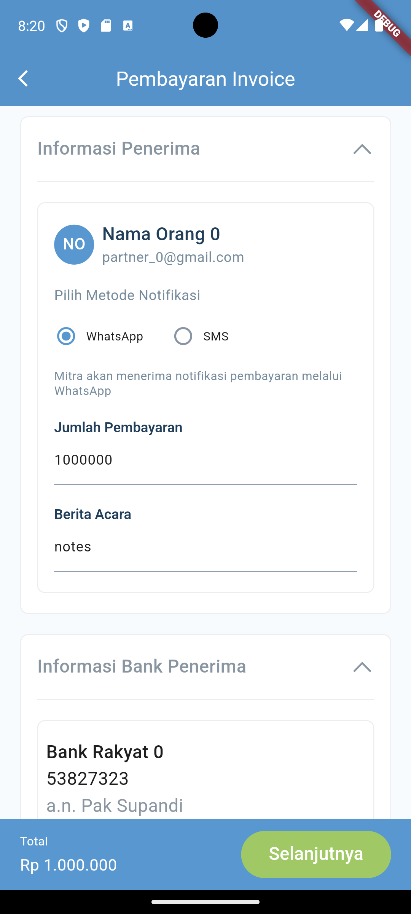
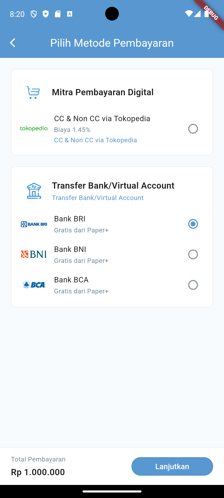
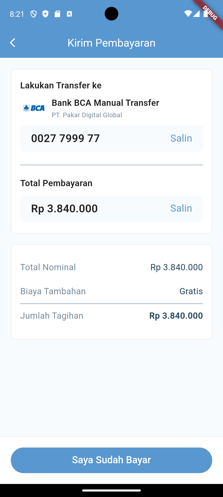
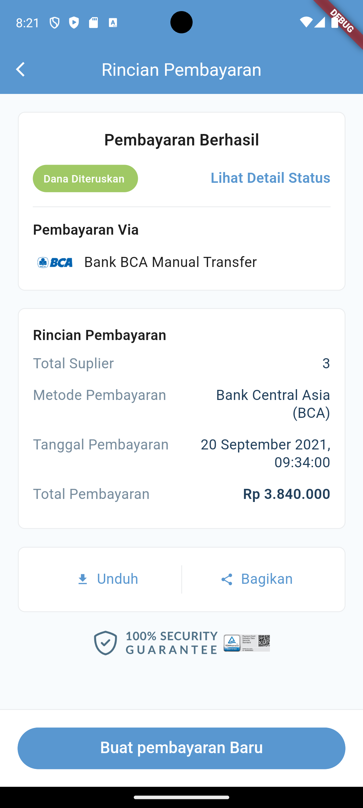

# payment_invoice_app

A Flutter project for paper.id assesment test.


This project is built using Flutter v3.24.5. If you are using a different version of Flutter, some code adjustments may be required to ensure compatibility and proper functionality.

To manage package linking, this project utilizes [Melos](https://melos.invertase.dev/~melos-latest). If you haven’t installed Melos yet, you can do so by running the following command:

```
dart pub global activate melos
```
Once Melos is installed, execute the following commands to set up and run the project:

```
melos bs
flutter run
```

## Architecture

This project is structured using a modular multi-package approach combined with Clean Architecture principles (simplified one actually). The architecture is designed to promote separation of concerns, scalability, and maintainability, but avoiding over-engineering. Below is an overview of the modules and their responsibilities:

### third_parties_module
This module serves as the central hub for all third-party dependencies used in the project. By isolating external libraries here, we ensure better dependency management and make it easier to update or replace libraries in the future.

### core_module
The core_module contains core and common functionalities that are shared across the entire application. This includes utilities, constants, theme configurations, and any other reusable components that do not belong to a specific feature or layer.

### domain_module
This module houses the business logic and application-specific entities. It defines the core rules and behaviors of the application, independent of any external frameworks or implementations. This layer is purely abstract and serves as the foundation for the application's functionality.

### datasource_module
The datasource_module is responsible for data handling, including networking (API calls) and local storage (e.g., databases, shared preferences). It acts as the bridge between the application and external data sources.

### features_modules
Each feature in the application is encapsulated in its own module, representing the presentation layer. These modules contain UI components, state management, and feature-specific logic. 

### Screenshot


